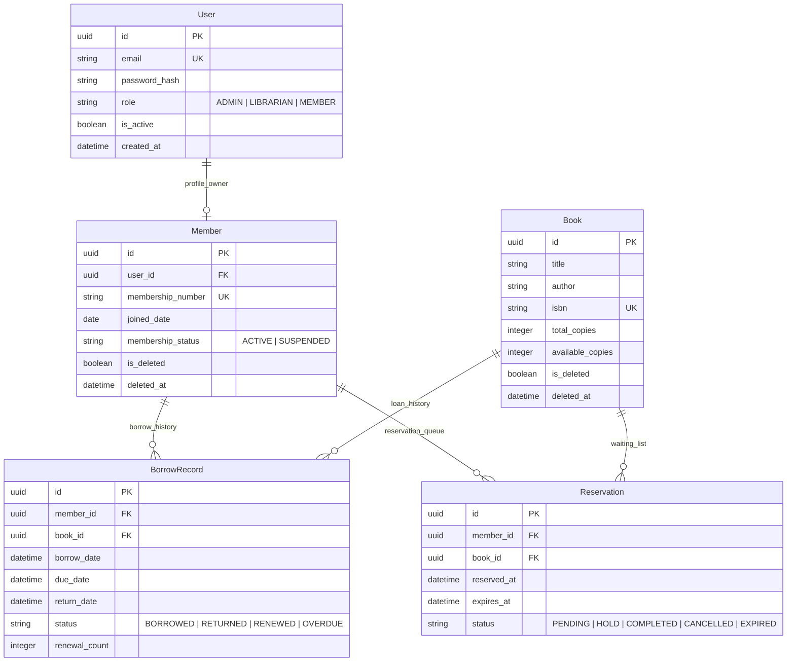
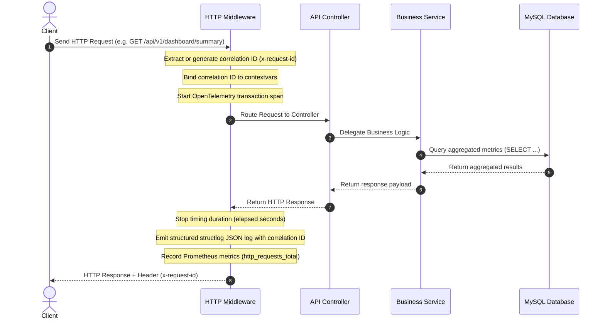
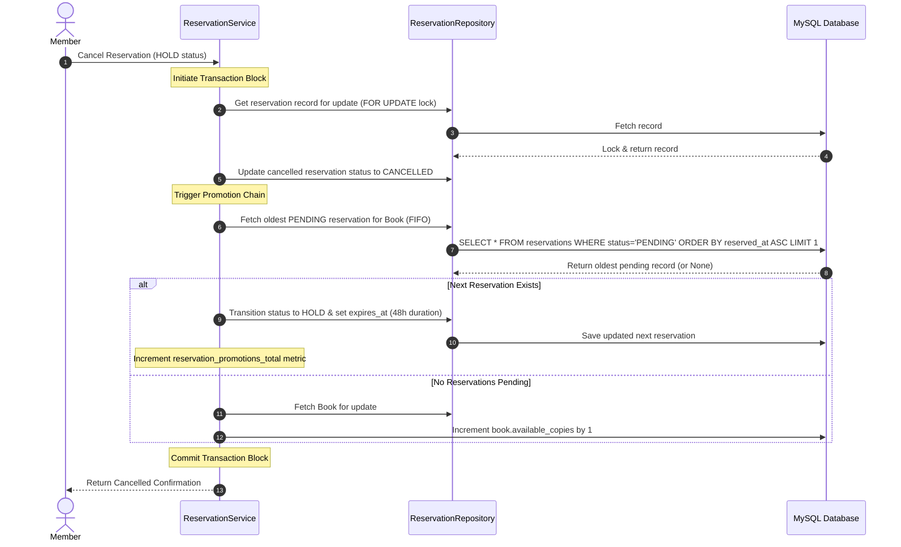

# 03 - System Architecture Document

Version: 1.0

## 1. High-Level Architectural Layers

```text
               Client (HTTP / REST)
                        │
                FastAPI API Layer (`app/api/v1`)
                        │
             Dependencies & Security (`app/dependencies`, `app/security`)
                        │
              Business Logic Service (`app/services`)
                        │
               Repository Layer (`app/repositories`)
                        │
            ORM & Database (`app/models`, `app/db`) -> MySQL 8.0
```

## 2. Directory Layout & Layer Responsibilities

- **`app/api/`**: HTTP endpoints, input/output serialization using Pydantic, HTTP status code management. No business logic or DB calls.
- **`app/services/`**: Core domain logic, validation of business rules, workflow orchestration, atomic transaction management.
- **`app/repositories/`**: Database queries, CRUD abstraction, filters, pagination, SQLAlchemy ORM interactions.
- **`app/models/`**: Declarative SQLAlchemy models.
- **`app/schemas/`**: Strict Pydantic v2 validation models.
- **`app/core/`**: Configuration, security utilities, and structured logging.
- **`app/middleware/`**: Cross-cutting HTTP middlewares (Correlation ID, Process Time, Exception Handler).

---

## 3. Visual System Diagrams

### 3.1 Entity-Relationship (ER) Diagram
This diagram outlines the complete database schema layout, showing relationship bounds across users, members, book metadata, borrowing transactions, and FIFO queue reservations.



### 3.2 Request Correlation & Middleware Lifecycle
This sequence diagram tracks the flow of an HTTP request, demonstrating correlation header injection via context-local variables (`contextvars`), Prometheus metrics logging, and OpenTelemetry spans tracing.



### 3.3 FIFO Reservation Expiration & Promotion Flow
This sequence diagram shows the automatic promotion workflow triggered during hold queue cancellations or background sweeper runs.


